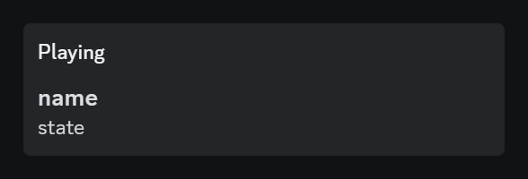

# Game server status bot
Discord bot for displaying game server information in bot status.

## How to run the bot
After filling up the config, creating .env file with required data and ensuring that you have deno installed, you can:
- run it using:
    ```shell
    deno task start
    ```
- run it with [PM2](https://pm2.keymetrics.io/) using:
    ```shell
    deno task pm2
    ```

## About Discord bot status
Bot status is an object containg *name*, *state* and *type*. They're shown as in the following image:  
  
Where *Playing* is the activity type set by the *type*

## Putting dynamic data into Discord bot status
You can insert dynamic game server data into *name* and *state* by putting *{[some_gamedig_response_key](https://github.com/gamedig/node-gamedig?tab=readme-ov-file#query-response)}* in a string, e.g. "Players: {numplayers}".  
Be aware that using keys with an object or array type can result in unexpected behaviour.  
Also don't use it in strings displayed when server is offline, because it will simply end up with unsubstituted values in bot status. You might be aware, that it is not possible to fetch data from offline or not existing server :> 

## Config
| **key** | **type** | **description** |
|:---|:---|:---|
| type | string | One of the game type IDs listed in the [games list](https://github.com/gamedig/node-gamedig/blob/HEAD/GAMES_LIST.md) |
| host | string | Hostname or IP of the game server. |
| port | number | Connection port or query port for the game server. |
| maxRetries | number | Number of retries to query server in case of failure. |
| refreshTime | number | Every how many seconds the status should be refreshed. |
| nameIfServerOnline | string | Text displayed as the name of the bot status if server is online. You can use [dynamic data](https://github.com/kameqdev/game-server-status-bot?tab=readme-ov-file#putting-dynamic-data-into-discord-bot-status) there. |
| nameIfServerOffline | string | Text displayed as the name of the bot status if server is offline. Gets the previous value if this one is not set. You can use [dynamic data](https://github.com/kameqdev/game-server-status-bot?tab=readme-ov-file#putting-dynamic-data-into-discord-bot-status) there. |
| nameIfPasswordRequired | string | Text displayed as the name of the bot status if server requires password. Gets the previous value if this one is not set. You can use [dynamic data](https://github.com/kameqdev/game-server-status-bot?tab=readme-ov-file#putting-dynamic-data-into-discord-bot-status) there. |
| stateIfServerOnline | string | Text displayed as the state of the bot status if server is online. You can use [dynamic data](https://github.com/kameqdev/game-server-status-bot?tab=readme-ov-file#putting-dynamic-data-into-discord-bot-status) there. |
| stateIfServerOffline | string | Text displayed as the state of the bot status if server is offline. Gets the previous value if this one is not set. You can use [dynamic data](https://github.com/kameqdev/game-server-status-bot?tab=readme-ov-file#putting-dynamic-data-into-discord-bot-status) there. |
| stateIfPasswordRequired | string | Text displayed as the state of the bot status if server requires password. Gets the previous value if this one is not set. You can use [dynamic data](https://github.com/kameqdev/game-server-status-bot?tab=readme-ov-file#putting-dynamic-data-into-discord-bot-status) there. |
| typeIfServerOnline | number | [ActivityType](https://discord-api-types.dev/api/discord-api-types-v10/enum/ActivityType) representing the type of bot status if server is online. |
| typeIfServerOffline | number | [ActivityType](https://discord-api-types.dev/api/discord-api-types-v10/enum/ActivityType) representing the type of bot status if server is offline. Gets the previous value if this one is not set. |
| typeIfPasswordRequired | number | [ActivityType](https://discord-api-types.dev/api/discord-api-types-v10/enum/ActivityType) representing the type of bot status if server requires password. Gets the previous value if this one is not set. |
| logging | boolean | Whether console logs should be enabled. |

## .env
TOKEN: Your bot's token. See *.env_example*.

## Troubleshooting
- If you're experiencing an *undefined* word in bot status, check if all of dynamic data is spelled correctly in *config.json*.
